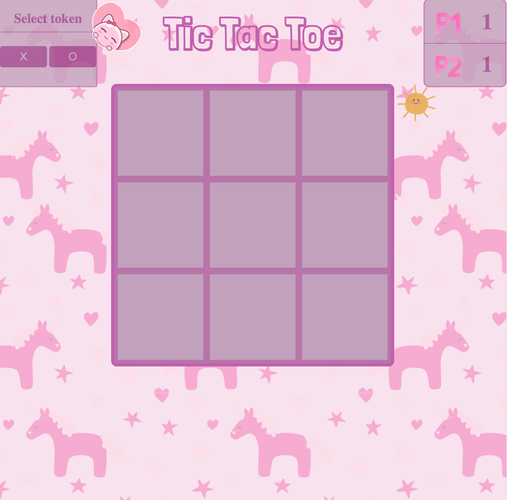

Tic Tac Toe
======================

## **Overview**

It is designed for my kid, so so so pinky.

It's a very simple 2 players game, to illstrate the use of html, css and javascript to organise the project. It's very easy to play.

--------
### Main game part:
* Player1 will take the first turn. 
* Before each round started, the player could select a token from the sidebar at the top left corner.Once the game started, token can't be changed till the game is over.
* There is another icon at the top right corner. Once press it, it will slide in a summary which records the number of wins for both players.
* Each round, it will pop up a little box showing which player win the game or the game is in draw.

### Project instruction
>[Here is the project instruction.](https://gist.github.com/wofockham/8e959d5cfe7d120f1157)

